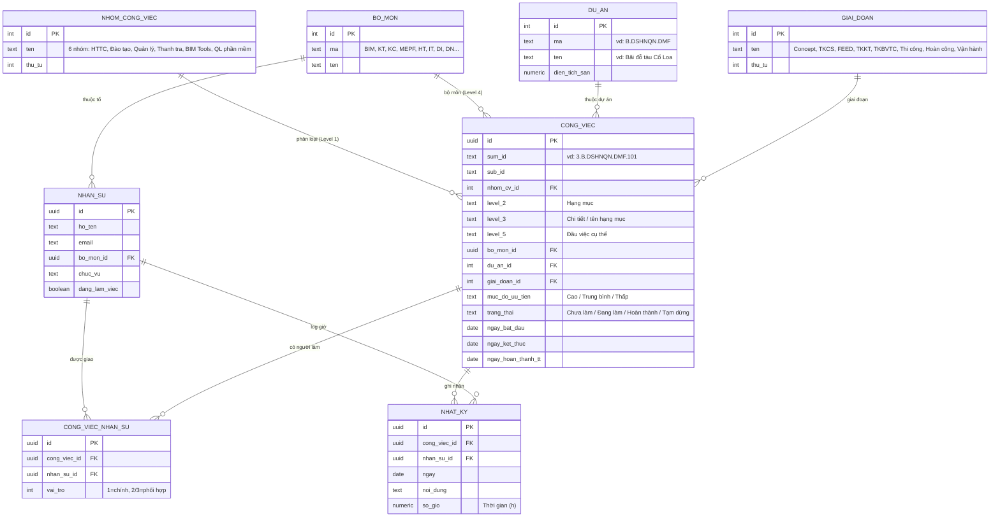

# Sơ đồ Database — Web QLCV phòng BIM

> Thiết kế dựa trên file `WM_New.xlsx` (cách phòng đang quản lý bằng Excel).
> Nền tảng: **Supabase (PostgreSQL)**. Xem preview Mermaid bằng cách mở file này → nút Preview của VSCode.

---

## 1. Sơ đồ quan hệ (ERD)

---

## 2. Giải thích ánh xạ từ Excel → Database

| Trong Excel | Trong Database |
|---|---|
| Sheet **Data** (danh mục) | Các bảng tra cứu: `NHOM_CONG_VIEC`, `BO_MON`, `DU_AN`, `GIAI_DOAN` |
| **Bảng 1–7** (giao việc) | Bảng `CONG_VIEC` + `CONG_VIEC_NHAN_SU` |
| Cột "Nhân sự thực hiện 01/02/03" | `CONG_VIEC_NHAN_SU` (quan hệ nhiều-nhiều, `vai_tro` 1/2/3) |
| Sheet **XD / MEPF / IT** (log ngày) | Bảng `NHAT_KY` (mỗi dòng = 1 người + 1 việc + 1 ngày + số giờ) |
| **Report 1–4** (tổng hợp) | **Không cần bảng riêng** → dùng VIEW/query tự tính |

### Vì sao thiết kế thế này
- **Level 1 / 4 / Dự án / Giai đoạn** = giá trị lặp lại nhiều → tách thành bảng tra cứu (tránh gõ tay sai như `4..003` trong Excel).
- **Level 2 / 3 / 5** = mô tả chi tiết, ít chuẩn hóa → để dạng text trong `CONG_VIEC` cho linh hoạt.
- **Nhân sự ↔ Công việc** là nhiều-nhiều (1 việc nhiều người, 1 người nhiều việc) → bảng nối `CONG_VIEC_NHAN_SU`.
- **Timesheet ngày** tách riêng (`NHAT_KY`) thay vì trải cột theo ngày như Excel → dễ tổng hợp, không giới hạn số ngày.

---

## 3. Report tự động (thay cho sheet Report 1–4)

Các báo cáo sẽ là **truy vấn**, không lưu trữ:

- **Report 1/2** — Thống kê theo nhóm: `COUNT` công việc theo `nhom_cv_id` × `trang_thai` (+ đếm quá hạn = `ngay_ket_thuc < today AND trang_thai != 'Hoàn thành'`).
- **Report 3** — Theo nhân sự: join `CONG_VIEC_NHAN_SU`, group theo `nhan_su_id`.
- **Report 4** — Định mức: `SUM(so_gio)` từ `NHAT_KY` group theo nhân sự × loại đầu việc.

---

## 4. Trạng thái triển khai
- [x] Phân tích nghiệp vụ từ Excel
- [x] Thiết kế ERD
- [ ] Chọn frontend (Next.js / React / HTML thuần)
- [ ] Tạo bảng trên Supabase (SQL migration)
- [ ] Dựng giao diện + deploy Vercel
